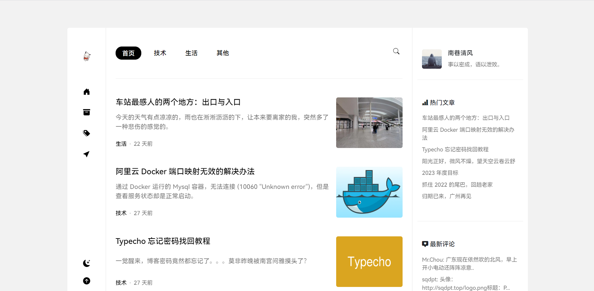

# Jasmine

 

🌼 Jasmine，一款 Typecho 主题。专为博客类网站开发，响应式设计，在移动端也有不错体验。主要使用白、灰、黑三种配色，整体简洁、精致、美观。

> 如果觉得主题还不错，请帮忙点个 start 😁
> 
> 您的 start 是这个项目维护下去的坚实动力。
> 
> 欢迎进群交流主题、Typecho 等相关问题。 QQ 群：[539165194](https://qm.qq.com/cgi-bin/qm/qr?k=oXM0EmLxXmgKfE1UDRlBY-g7Rkrx30oL&jump_from=webapi&authKey=uQdwWraveNKYBm/BQs88WXkNagEUr9tCkf/gbdQ9FasOviKYVhUd/wUME0q0AtnI)

## 预览

DEMO：[南巷清风](https://www.liaocp.cn/)

## 主题亮点

* 响应式设计
* 针对 SEO 优化
* 支持切换夜间模式
* 无刷新跳转页面
* 说说功能
* 支持置顶文章显示
* 支持评论 QQ 头像显示
* 支持代码高亮
* 支持随机文章跳转
* 支持文章缩略图设置
* 支持外观设置备份
* 主题更新检测
* ……

## 主题下载

[jasmine.zip](https://github.com/liaocp666/Jasmine/releases/latest/download/jasmine.zip)

## 主题文档

[Github](https://github.com/liaocp666/Jasmine/wiki) | [Gitee（国内）](https://gitee.com/LiaoChunping/Jasmine/wikis/pages)

## 主题交流

您可以在[ QQ 群 ](https://qm.qq.com/cgi-bin/qm/qr?k=oXM0EmLxXmgKfE1UDRlBY-g7Rkrx30oL&jump_from=webapi&authKey=uQdwWraveNKYBm/BQs88WXkNagEUr9tCkf/gbdQ9FasOviKYVhUd/wUME0q0AtnI)或当前平台对主题进行报告错误（Issues）、修复问题(Pull requests)。

## 许可协议

* Jasmine 主题使用 [GPL V3.0](https://github.com/liaocp666/theme-jasmine/blob/main/LICENSE) 协议开源。

* 您必需遵守 [GPL V3.0](https://github.com/liaocp666/theme-jasmine/blob/main/LICENSE) 协议进行二次开发或移植主题，以及声明原主题名称及其链接。

* **您可以删除页脚的作者信息。**

* **您必须在页脚保留 Jasmine 主题的名称及其链接。**

## 打赏一下

如果觉得主题制作的不错，不如请作者喝杯咖啡~~

